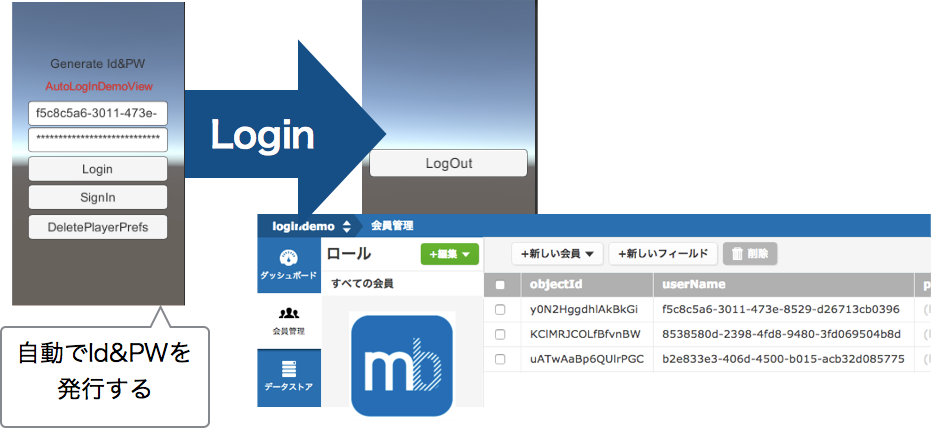
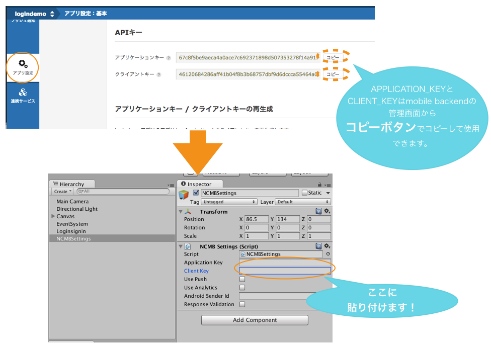
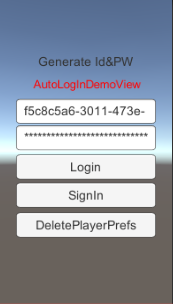
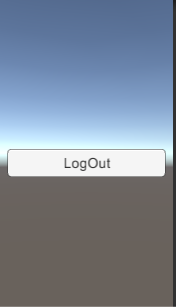

# 【Unity】アプリに自動会員登録機能を追加しよう！


## 概要
* [ニフティクラウドmobile backend](http://mb.cloud.nifty.com/)の『会員管理機能』を利用してUnityアプリに自動でID&PWを発行するログイン機能を実装したサンプルプロジェクトです
* 簡単な操作ですぐに [ニフティクラウドmobile backend](http://mb.cloud.nifty.com/)の機能を体験いただけます★☆

## ニフティクラウドmobile backendって何？？
スマートフォンアプリのバックエンド機能（プッシュ通知・データストア・会員管理・ファイルストア・SNS連携・位置情報検索・スクリプト）が**開発不要**、しかも基本**無料**(注1)で使えるクラウドサービス！今回はデータストアを体験します

注1：詳しくは[こちら](http://mb.cloud.nifty.com/price.htm)をご覧ください


## 動作環境
* Mac OS X 10.10.5(Yosemite)
* Unity ver. 5.3.5f1
* MonoDevelop-Unity ver. 5.9.6
* NCMB UnitySDK v2.2.0

※上記内容で動作確認をしています。


## 手順
### 1. [ニフティクラウドmobile backend](http://mb.cloud.nifty.com/)の会員登録とログイン→アプリ作成

* 上記リンクから会員登録（無料）をします。登録ができたらログインをすると下図のように「アプリの新規作成」画面が出るのでアプリを作成します


* アプリ作成されると下図のような画面になります
* この２種類のAPIキー（アプリケーションキーとクライアントキー）はXcodeで作成するiOSアプリに[ニフティクラウドmobile backend](http://mb.cloud.nifty.com/)を紐付けるために使用します


* 動作確認後に会員情報が保存される場所も確認しておきましょう


### 2. [GitHub](https://github.com/hounenhounen/UnityAutoLoginApp)からサンプルプロジェクトのダウンロード

* この画面([GitHub](https://github.com/hounenhounen/UnityAutoLoginApp))のボタンをクリックし、さらにボタンをクリックしてサンプルプロジェクトをMacにダウンロードします

### 3. Unityでアプリを起動

* ダウンロードしたフォルダを解凍し、Unityから開いてください。その後、Loginsigninシーンを開いてください。


### 4. APIキーの設定

* Loginsigninシーンの`NCMBSettings`を編集します
* 先程[ニフティクラウドmobile backend](http://mb.cloud.nifty.com/)のダッシュボード上で確認したAPIキーを貼り付けます



* それぞれ「Application Key」と「Client Key」のテキストフィールドに「アプリケーションキー」と「クライアントキー」を貼り付けます

### 5. 動作確認
* Unity画面で上部真ん中の実行ボタン（さんかくの再生マーク）をクリックします



* シミュレーターが起動したら、Login&SignIn画面が表示されます
* 初回はIdとPWが自動で生成され最上位にあるテキストに__`Generate Id&PW`__と表示されます
* 初回は__`SignUp`__ ボタンをクリックして、会員登録を行います。
* 一度会員登録を行うと、PlayerPrefsにId,PWが保存されます。
* 次回からはPlayerPrefsからId,PWが読み込まれ入力欄に自動で表示され、最上位のテキストも__`Read Id&PW From PlayerPrefs`__に変わります。

* 今回は説明用のデモプロジェクトとして、自動会員登録機能にも関わらずSignIn,Login画面を表示しております。任意のプロジェクトに入れる場合こちらの画面をSkipすることも可能です。
* また「DeletePlayerPrefs」はPlayerPrefsに保存した情報を消去し、再度会員登録を行えるようにするボタンです。

* 会員登録・ログインが成功すると、下記画面が表示されます
 * このときmBaaS上に会員情報が作成されます！
 * ログインに失敗した場合は画面にエラー内容が表示されます
 * 万が一エラーが発生した場合は、[こちら](http://mb.cloud.nifty.com/doc/current/rest/common/error.html)よりエラー内容を確認いただけます



* __`Logout`__ ボタンをタップするとログアウトし、元の画面に戻ります
* 次回からはPlayerPrefsからId,PWが読み込まれ入力欄に自動で表示されるので、再度ログインができます。


-----

* 保存に成功したら、[ニフティクラウドmobile backend](http://mb.cloud.nifty.com/)のダッシュボードから「会員管理」を確認してみましょう！


## 解説
サンプルプロジェクトに実装済みの内容のご紹介

#### SDKのインポートと初期設定
* ニフティクラウドmobile backend の[ドキュメント（クイックスタート）](http://mb.cloud.nifty.com/doc/current/introduction/quickstart_unity.html)をUnity版に書き換えたドキュメントをご用意していますので、ご活用ください

#### ロジック
 * `Loginsignin.cs`,`Logout.cs`にロジックを書いています
 * ログイン、会員登録、ログアウト部分の処理は以下のように記述されます　※ただし、左記処理以外のコードは除いています

`Loginsignin.cs`

以下のロジックでは、uuidを発行し、Id,PWを生成しています。

```csharp
//Id,PWの自動生成箇所
public Dictionary<string,string> GenerateIdPW(){
  Dictionary<string, string> accountData = new Dictionary<string, string> ();
  System.Guid idGuid=System.Guid.NewGuid();
  System.Guid pwGuid=System.Guid.NewGuid();
  string Id_uuid=idGuid.ToString();
  string PW_uuid=pwGuid.ToString();
  accountData.Add ("Id",Id_uuid);
  accountData.Add ("PW",PW_uuid);
  return accountData;
}
```

以下の__`Start ()`__メソッドが初期化シーンの際に実行されるメソッドです。このメソッドで上記の__`GenerateIdPW()`__が呼び出されます。__`Start ()`__ではPlayerPrefsにId,PWが保存されているか否かを判別し、保存されていれば入力欄にその値を挿入します。保存されていなければId,PWを__`GenerateIdPW()`__で発行したのちに入力欄に挿入しています。

```csharp
// Use this for initialization
void Start ()
{
  if (PlayerPrefs.GetString ("Id") == "" && PlayerPrefs.GetString ("PW") == "") {
    Dictionary<string, string> accountData = new Dictionary<string, string> ();
    accountData = GenerateIdPW ();
    UserName.text = accountData ["Id"];
    PassWord.text = accountData ["PW"];
    Status.text = "Generate Id&PW";
  } else {
    UserName.text = PlayerPrefs.GetString ("Id");
    PassWord.text = PlayerPrefs.GetString ("PW");
    Status.text = "Read Id&PW From PlayerPrefs";
  }
}
```
以下のメソッドで会員登録を行っています。入力欄からId,PWを読み込み会員登録を行います。
会員登録に成功したのちに、PlayerPrefsにId,PWを保存しています。

```csharp
public void Signin ()
{
  print (UserName.text);
  print (PassWord.text);


  //NCMBUserのインスタンス作成
  NCMBUser user = new NCMBUser ();

  //ユーザ名とパスワードの設定
  user.UserName = UserName.text;
  user.Password = PassWord.text;

  //会員登録を行う
  user.SignUpAsync ((NCMBException e) => {
    if (e != null) {
      UnityEngine.Debug.Log ("新規登録に失敗: " + e.ErrorMessage);
    } else {
      UnityEngine.Debug.Log ("新規登録に成功");
      PlayerPrefs.SetString ("Id",UserName.text);
      PlayerPrefs.SetString ("PW",PassWord.text);
      PlayerPrefs.Save();
      Application.LoadLevel ("LogOut");
    }
  });

}
```

以下でログインを行っています。入力欄からId,PWを読み込みログインを行います。

```csharp
public void Login ()
{
  print (UserName.text);
  print (PassWord.text);

  // ユーザー名とパスワードでログイン
  NCMBUser.LogInAsync (UserName.text, PassWord.text, (NCMBException e) => {
    if (e != null) {
      UnityEngine.Debug.Log ("ログインに失敗: " + e.ErrorMessage);
    } else {
      UnityEngine.Debug.Log ("ログインに成功！");
      Application.LoadLevel ("LogOut");
    }
  });

}
```


`Logout.cs`

ログアウトは以下のメソッドで行っています。

```csharp
// ログアウト
public void Logout_user ()
    {
        NCMBUser.LogOutAsync ((NCMBException e) => {
            if (e != null) {
                UnityEngine.Debug.Log ("ログアウトに失敗: " + e.ErrorMessage);
            } else {
                UnityEngine.Debug.Log ("ログアウトに成功");
                Application.LoadLevel ("Loginsignin");
            }
        });

    }
```

## 参考
* ニフティクラウドmobile backend の[ドキュメント（会員管理）](http://mb.cloud.nifty.com/doc/current/user/basic_usage_unity.html)
